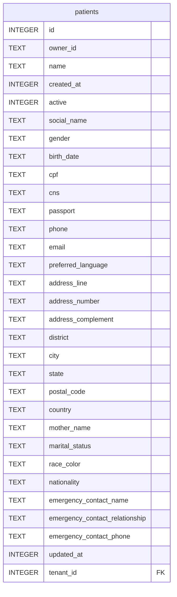

{/* Generated by bun run db:erd (product/packages/db/scripts/generate-erd.mjs) — do not edit. */}

Owned by `plugins/patients`.

## ER diagram

```mermaid
erDiagram


"patients" {
  INTEGER id
  TEXT owner_id
  TEXT name
  INTEGER created_at
  INTEGER active
  TEXT social_name
  TEXT gender
  TEXT birth_date
  TEXT cpf
  TEXT cns
  TEXT passport
  TEXT phone
  TEXT email
  TEXT preferred_language
  TEXT address_line
  TEXT address_number
  TEXT address_complement
  TEXT district
  TEXT city
  TEXT state
  TEXT postal_code
  TEXT country
  TEXT mother_name
  TEXT marital_status
  TEXT race_color
  TEXT nationality
  TEXT emergency_contact_name
  TEXT emergency_contact_relationship
  TEXT emergency_contact_phone
  INTEGER updated_at
  INTEGER tenant_id FK
}
```

## Tables

- [`patients`](./patients.mdx)
